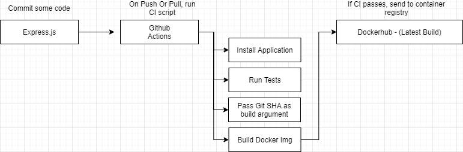
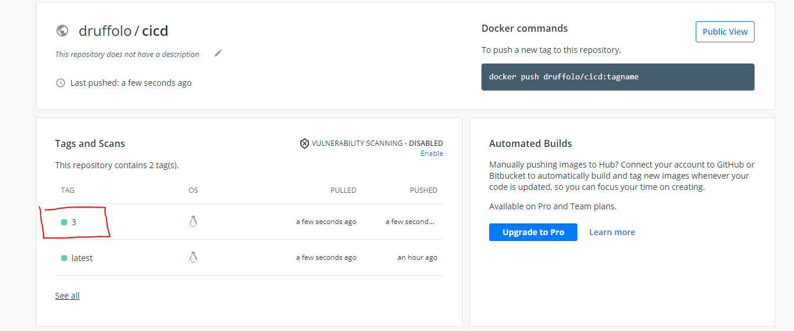

# Express.js Dockerhub CICD Example
An example repository of how Github Actions can be used with Docker to test and push a Docker image to DockerHub container registry automatically.

## Purpose
The purpose of this code body is to demonstrate the concept of building , testing and deploying a express.js application to Dockerhub via Github Actions CICD. 
Once a image is pushed to a registry, it is very easy to deploy to any cloud hosting services as long as Dockerhub integration is avaliable.
Within this example , The use of test packages such as Jest and Supertest outline how testing can enhance the pipline and perform a check on the endpoint before we build the final docker image and send it off to the registry.

## Technology
 - Express.js
 - Docker
 - Dockerhub
 - Github Actions
 - Jest
 - Supertest

 ## Diagram
 

## Run Locally
 To run locally, run:
```
npm install 
```
Then navigate to:
```
http://Localhost:8080
```

## Run tests
 To run tests locally, run:
```
npm run test 
```
Result should be:
```
PASS  ./server.test.js
  Test Base Route GET /
    √ checking for response object properties (28 ms)
    √ Check content-type is JSON (4 ms)

Test Suites: 1 passed, 1 total
Tests:       2 passed, 2 total

```

## Setup DockerHub CI and Github Actions
 Before attempting, make sure you have a Dockerhub account.
 To setup CI, in github repository navigate to 'settings' then 'secrets' and add 2 new secrets:
```
DOCKER_USER: *******
DOCKER_PASSWORD: *******

```
These should be your Dockerhub account credentials.
Once this is done, test the action with a commit. If all goes well, your image should be pushed to your Dockerhub container registry.
## Result:
Your image will be pushed to dockerhub with the Actions run number set as the tag. in this instance, its 3 as the pipline has been ran 3 times.
